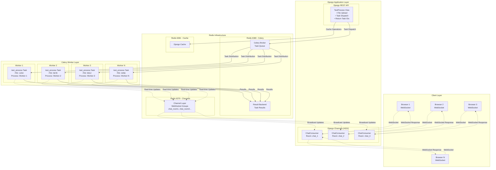
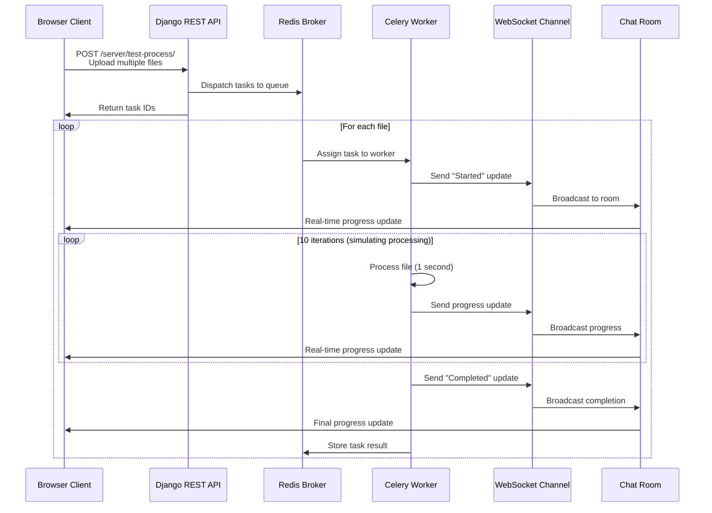
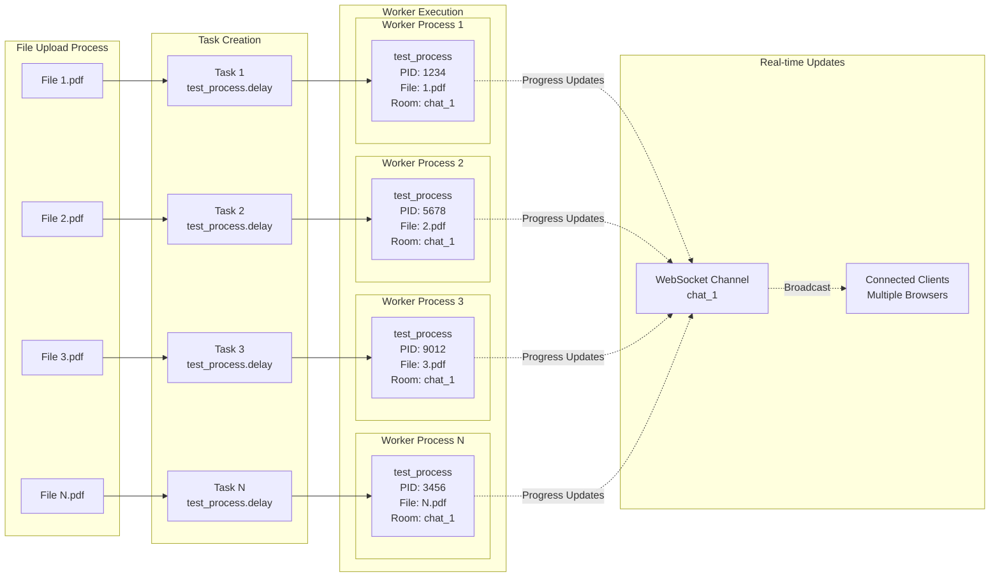
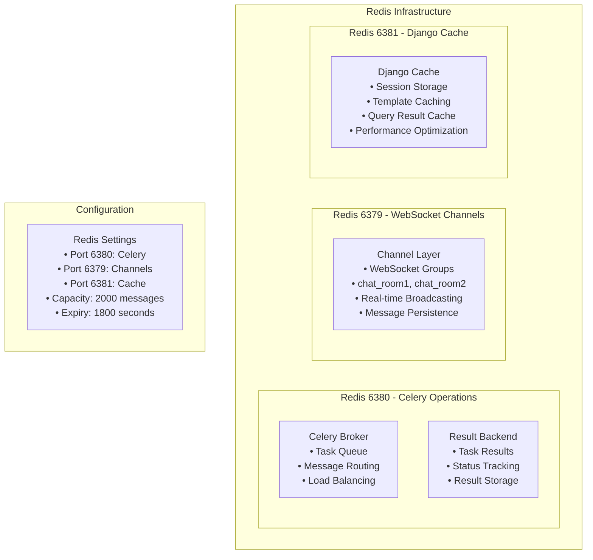

# Project Parallelism Flow - Mermaid Diagram

## Architecture Overview

## Task Execution Flow

## Parallel Processing Details

## Redis Infrastructure

## Key Features

### 🔄 **Parallel Processing**
- Multiple files processed simultaneously
- Each file gets its own Celery task
- Tasks distributed across multiple workers
- Process-level isolation for fault tolerance

### 📡 **Real-time Communication**
- WebSocket connections for live updates
- Progress broadcasting to all connected clients
- Asynchronous task-to-client communication
- Room-based message routing

### ⚙️ **Scalability**
- Horizontal scaling with multiple workers
- Redis-based message brokering
- Load balancing across worker processes
- Fault tolerance with task retry mechanisms

### 🛠️ **Configuration**
- **Celery**: 6 tasks per worker, 1200s time limit
- **Redis**: Separate instances for different purposes
- **WebSocket**: 2000 message capacity, 1800s expiry
- **Multiprocessing**: Process isolation and monitoring
